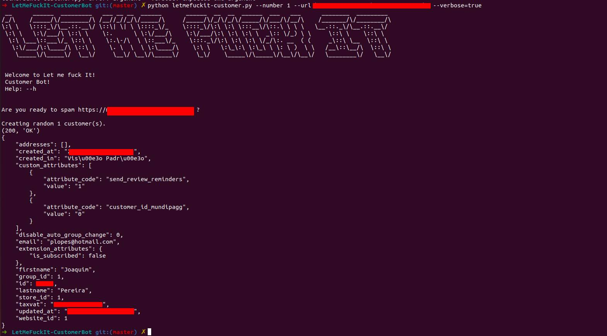

# LetMeFuckIt CustomerBot 

The bot abuses the Magento public api to insert customers. (/rest/V1/customers)

**LetMeFuckIt Customer** was written in Python and uses the following libraries:

*requests, random, Faker*

## Usage: ##
```
python letmefuckit-customer.py --url "https://magento.store.com" --number 10 --verbose=true
```




## Options ##

--url <url>
--verbose
--number <integer>
--help 

## Required Modules ##
```
pip install requests
pip install random
pip install Faker
```

## FAQ ## 

A: Script returns (401, 'Unauthorized') 

Q: The store have a patch for this abuse


# Patch - How to block this?

Default configuration for this resource is "anonymous", to prevent we change anonymous to "self"

Create a file

`Vendor\Module\etc\webapi.xml`

```
<?xml version="1.0"?>
<routes xmlns:xsi="http://www.w3.org/2001/XMLSchema-instance" xsi:noNamespaceSchemaLocation="urn:magento:module:Magento_Webapi:etc/webapi.xsd">
    <route url="/V1/customers" method="POST">
        <service class="Magento\Customer\Api\AccountManagementInterface" method="createAccount"/>
        <resources>
            <resource ref="self"/>
        </resources>
    </route>
</routes>
```


